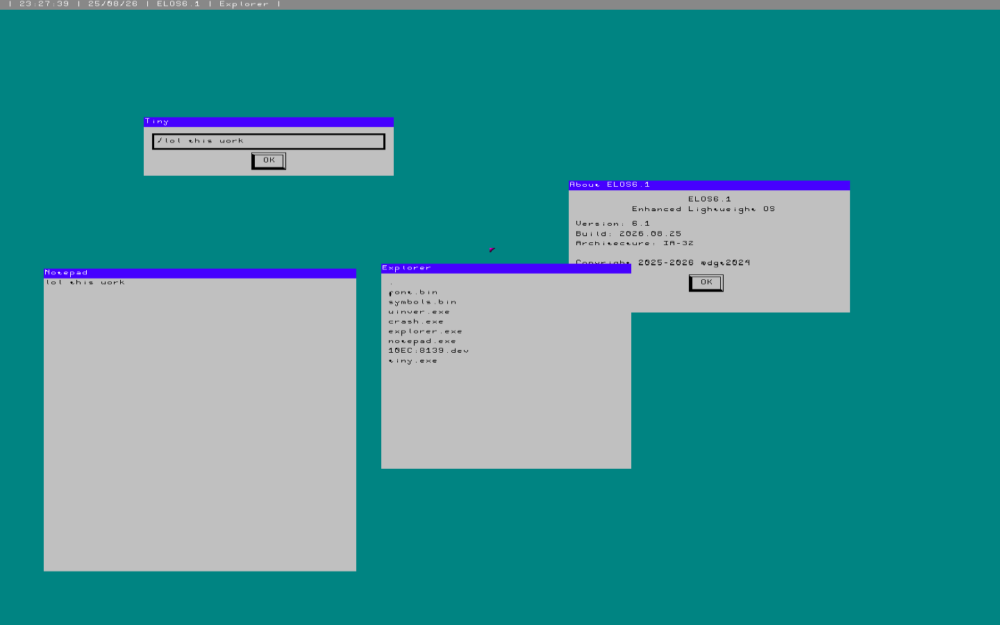
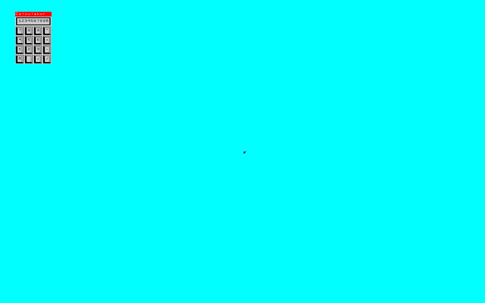
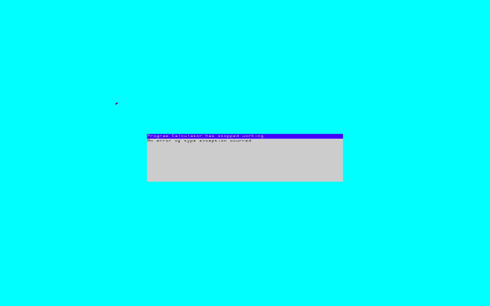
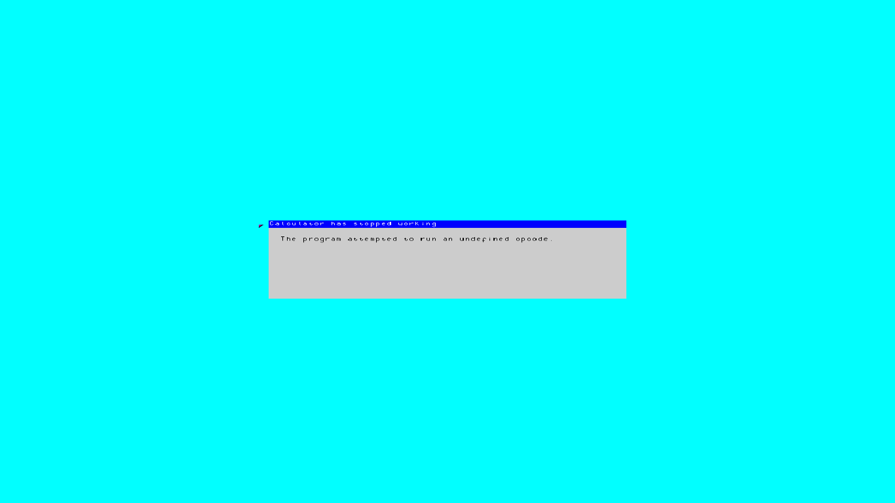
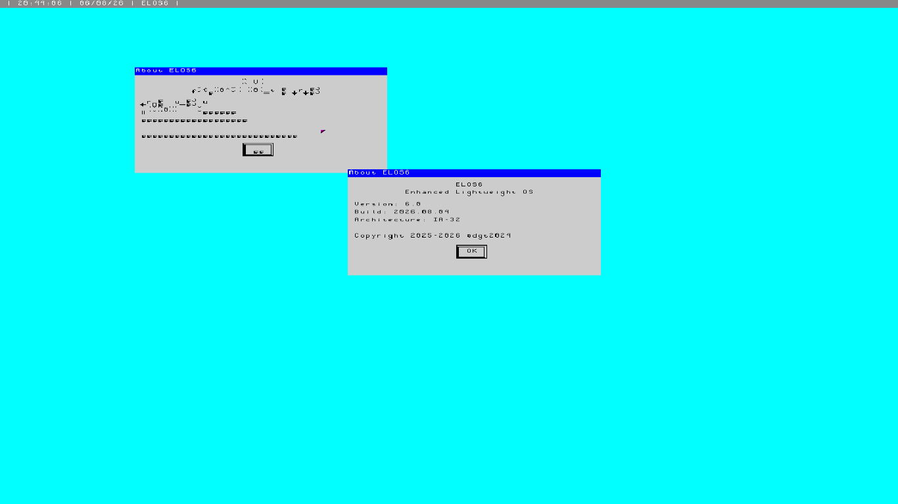
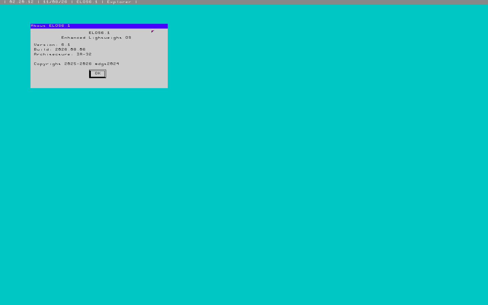
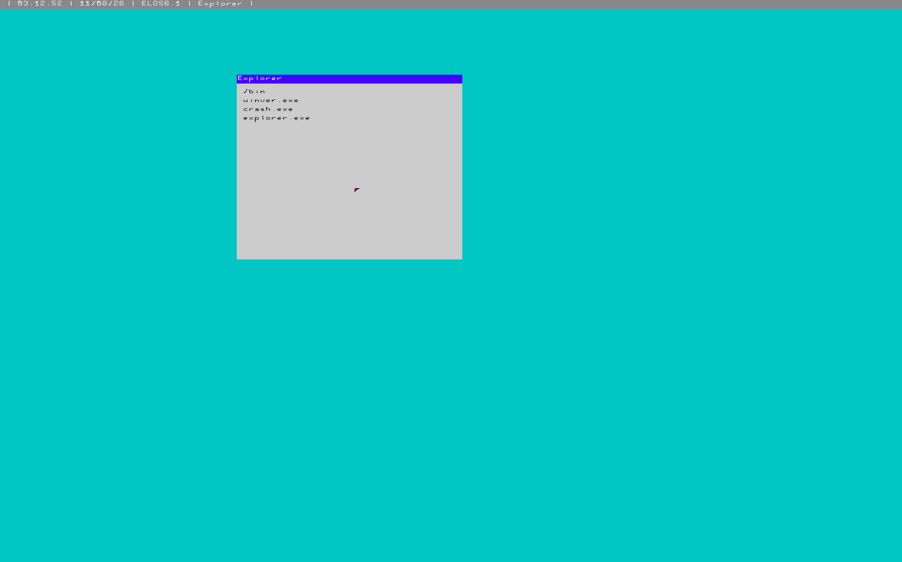
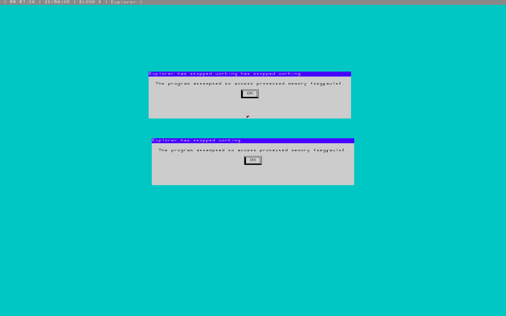
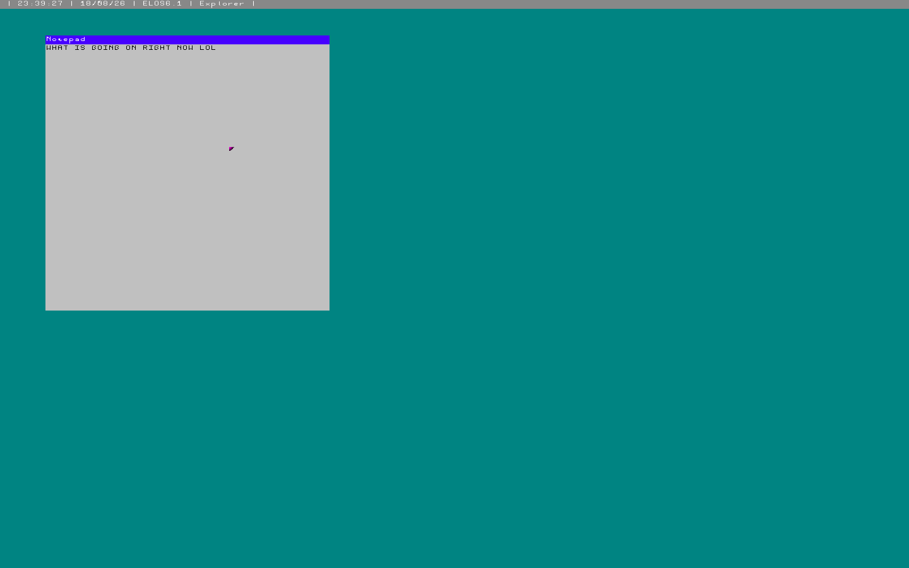

# ELOS6.1

**Enhanced Lightweight Operating System v6.1**

ELOS is an operating system family created in August 2025. ELOS6 was started in July 2026, with ELOS6.1 beginning in August 2026 as a branch of ELOS6.

A tiny x86 IA-32 Operating System written entirely in Assembly.

It's an experiment in building an operating system from the ground up, without relying on Linux or GRUB, while keeping the system small and understandable.



# Features

## NOTE: ELOS6.1 is STILL in development, expect more

- 32-bit IA-32 x86 kernel
- Preemptive userland multitasking
- Paging-based dynamic memory and heap management
- Windowing compositor
- Simple ABI
- Custom filesystem and executable format
- PS/2 Keyboard and mouse support
- File explorer
- Notepad
- Tiny command prompt
- Exception handling (BSOD/Crash)
- System clock and date

# General Data

## Minimum Requirements

- 80386+/IA-32 compatible CPU
- 1.1 MB RAM minimum
- VGA/VESA-compatible display
- PS/2 keyboard/mouse (working on PCI USB drivers)
- Intel 8253/8254 Chip
- ATA/PATA disk as the primary master drive

## Building

```sh
./run.sh # Assembles and Runs the binary
```

# Evolution + Some history

## ELOS6

This was one of the first GUI outputs I made, and it became the foundation of the entire windowing system.


This windowing system was actually built on an idea that came from ELOS2, which was discarded in November 2025 due to its lack of modularity. Interestingly, the font also came back from ELOS1, which was discarded in August 2025 due to instability.


The font was brought back from then because I personally
didn't want to spend another 6 hours making another bitmap
font manually!


And this was very probably the last ELOS version I would make, as I was already proud of the modularity and architecture I had achieved.


The calculator was one of the first ideas I had for testing the GUI ABI, making it the first GUI application created for ELOS6. Although it wasn't functional at the time, it became the first userland application to run on ELOS6. :D


I changed the background color to cyan because I wanted to
copy Windows 95 (silly me...), but in the end I got feedback
about it being too light (which came with ELOS6.1 which
we'll see later on) :/



And I also finished the calculator GUI (which added the
square and the button).




I did take a lot of photos on the way (and some of them are
simply lost to my computer but can be found in messages,
which I won't be bothered to search).

## ELOS6.1

Here we get to ELOS6.1, which is simply a better (and fuller)
version of ELOS6 that added userland applications and a top
status bar showing the hour and some shortcuts to start
applications.




Then I added a filesystem (which had been in development
since I was finishing ELOS6) and added an app to look to
browse it, and fixed the bug we saw just earlier.




I also added background stuff as a PCI driver loader which
as of now, is broken; and fixed a LOT of bugs I found on the
way...




And I added a notepad (shortly after I fixed a bug) and then
I added keybind access, so like Shift+x making an uppercase
X and Shift+1 making an exclamation mark...
